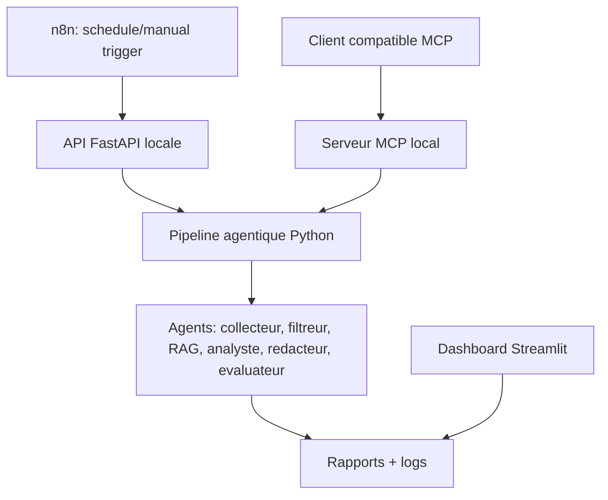

# Integration n8n, IA agentique et MCP

## Objectif

Cette extension rend le prototype plus interoperable :

- `n8n` orchestre le declenchement externe de la veille.
- L'IA agentique reste responsable du raisonnement metier : collecte, filtrage, RAG, analyse, redaction, evaluation.
- Le standard MCP expose les capacites du systeme comme outils reutilisables par un client compatible MCP.

## Architecture cible



## Usage de n8n

Le workflow importable se trouve dans `n8n/workflow_veille_frameworks_ia.json`.

Il contient :

- un declenchement manuel ;
- une planification hebdomadaire ;
- un appel HTTP `POST /pipeline/run` ;
- une recuperation du dernier rapport via `GET /reports/latest` ;
- un export CSV compatible Google Sheets ;
- une verification du statut via `GET /pipeline/status` ;
- une branche Human-in-the-Loop ;
- une branche fallback/correction si le rapport n'est pas approuve.

Avant d'utiliser n8n, lancer l'API :

```powershell
.venv\Scripts\uvicorn.exe source.api_server:app --host 0.0.0.0 --port 8000
```

Si n8n tourne hors Docker, remplacer `host.docker.internal` par `localhost` dans le workflow.

## Usage de MCP

Le serveur MCP est dans `source/mcp_server.py`.

Il expose les outils suivants :

- `run_market_watch`
- `get_pipeline_status`
- `list_generated_reports`
- `get_latest_report`
- `get_agent_logs`
- `set_report_validation`

Lancement :

```powershell
.venv\Scripts\python.exe source\mcp_server.py
```

Un client compatible MCP peut alors utiliser ces outils sans connaitre l'implementation interne du projet. C'est le point central de l'interoperabilite : les agents, orchestrateurs ou assistants externes consomment des outils standardises.

## Difference entre n8n et MCP

n8n orchestre des evenements et connecte des services : planification, HTTP, email, Slack, stockage.

MCP standardise l'exposition d'outils et de ressources a des agents IA. Dans notre cas, il permet a un agent externe de declencher la veille, lire les rapports ou consulter les logs.

## Place de l'IA agentique

Le systeme reste agentique car les responsabilites sont separees :

- Agent collecteur : collecte ou fallback.
- Agent filtreur : nettoyage et deduplication.
- Agent RAG : contextualisation interne.
- Agent analyste : scoring et recommandation.
- Agent redacteur : rapport.
- Agent evaluateur : controle qualite.

n8n ne remplace pas ces agents. Il les declenche et peut diffuser leurs resultats.

## Tool usage et autonomie

Le prototype adopte une approche hybride :

- les outils sont exposes par API HTTP et MCP ;
- n8n orchestre les evenements, la validation humaine et la diffusion ;
- les agents Python executent les etapes metier avec logs, fallback et controle de schema.

Dans une version n8n strictement agentique, les notes "AI Agent" du workflow peuvent etre remplacees par de vrais noeuds Advanced AI utilisant les prompts fournis dans `docs/system_prompts_agents.md`.
