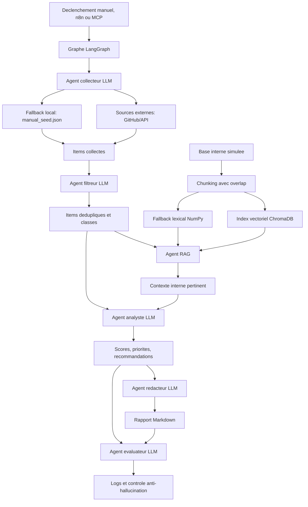

# Logigramme du flux de donnees

## Description courte

Le systeme collecte des signaux externes, les nettoie, recupere les informations internes pertinentes avec une pipeline RAG, puis genere une synthese priorisee. Chaque agent produit des logs horodates.
