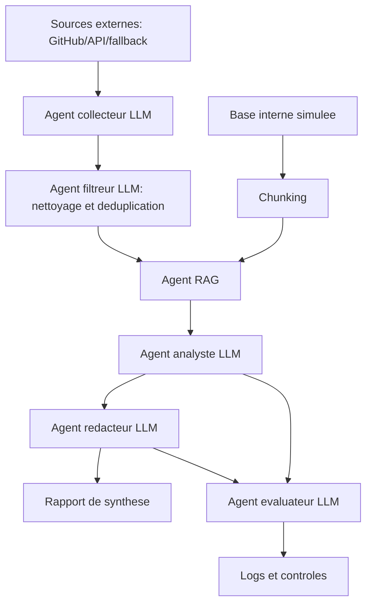
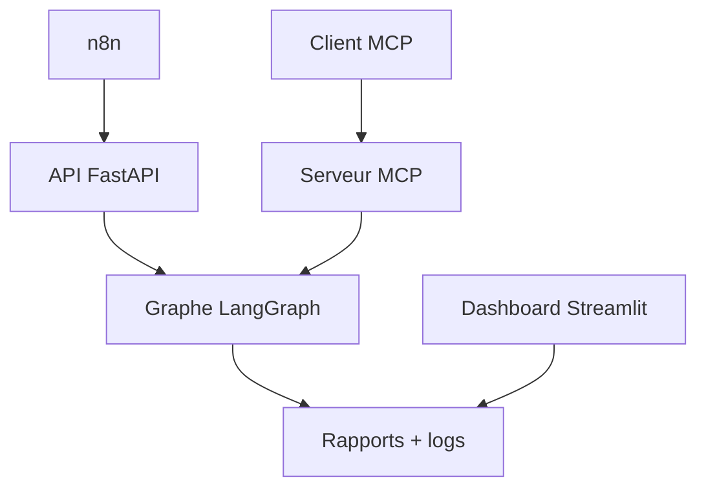

# Rapport du projet - Assistant Autonome de Veille sur les Frameworks IA

## 1. Contexte

L'ecosysteme des frameworks IA evolue rapidement : frameworks RAG, orchestration d'agents, evaluation, observabilite, connecteurs et outils MLOps changent en continu. Une veille manuelle devient couteuse, incomplete et difficile a relier aux besoins internes de l'entreprise.

Le systeme propose automatise cette veille. Il collecte des signaux externes, les filtre, les croise avec une base de connaissances interne simulee, puis produit une synthese exploitable par une equipe technique.

## 2. Objectifs

- Surveiller les tendances autour de LangChain, LlamaIndex, LangGraph, CrewAI, AutoGen, Haystack, DSPy et Smolagents.
- Contextualiser les nouveautes avec la base interne de l'entreprise.
- Produire un rapport de synthese avec recommandations.
- Visualiser les resultats dans un dashboard web de supervision.
- Integrer n8n comme orchestrateur externe.
- Exposer les outils du systeme via le standard MCP.
- Fournir des logs prouvant le passage de chaque agent LLM.
- Integrer des strategies de fallback, de controle anti-hallucination et de gestion de contexte.

## 3. Engineering workflow

Le flux global est detaille dans `docs/logigramme_flux_donnees.md`.

L'orchestration interne des agents est realisee avec LangGraph. Chaque agent LLM est represente par un noeud du graphe, et les donnees circulent dans un etat partage.



## 4. Pipeline RAG

La pipeline RAG utilise une base vectorielle ChromaDB persistante avec fallback lexical pour rester robuste pendant la demonstration.

1. Ingestion des documents Markdown de `data/knowledge_base_interne/`.
2. Decoupage en chunks de 120 mots avec 25 mots de recouvrement.
3. Calcul d'embeddings locaux deterministes.
4. Stockage des chunks dans ChromaDB sous `data/vector_db`.
5. Recherche vectorielle top-k.
6. Fallback lexical avec NumPy si ChromaDB est indisponible.
7. Injection des passages internes dans l'analyse de chaque tendance.

Dans une version production, les embeddings locaux peuvent etre remplaces par des embeddings OpenAI ou HuggingFace.

## 5. Agents LLM

Les agents principaux sont maintenant des agents LLM appeles via GitHub Models avec `langchain-openai`. Les traitements deterministes restent disponibles uniquement comme fallback si l'appel LLM ou une source externe echoue.

L'agent collecteur LLM normalise les signaux de marche issus de GitHub et du jeu local de secours, sans inventer d'URL ou de metriques.

L'agent filtreur LLM elimine les doublons, juge la pertinence et conserve les items correspondant aux mots-cles de veille : agent, RAG, release, orchestration, benchmark, evaluation.

L'agent RAG retrouve les passages internes pertinents pour chaque item externe.

L'agent analyste LLM calcule un score d'impact selon trois dimensions : fiabilite de la source, signal marche et proximite avec le contexte interne. Il genere aussi le texte de recommandation final, marque dans les donnees par `recommendation_source="llm"`.

L'agent redacteur LLM genere un rapport Markdown avec resume executif, analyse detaillee, sources et recommandations.

L'agent evaluateur LLM verifie que les items disposent d'une source, que les logs existent, que les recommandations sont separees des faits et que la validation humaine est presente.

## 5.1 Dashboard web

Un dashboard Streamlit est fourni dans `dashboard/app.py`. Il permet de visualiser les resultats sans ouvrir manuellement les fichiers JSON.

Il affiche :

- les indicateurs principaux : items collectes, items filtres, analyses, statut d'evaluation ;
- un tableau des recommandations par framework ;
- un graphique des scores d'impact ;
- la liste des rapports generes avec telechargement ;
- les logs recents par agent ;
- un bouton pour relancer la pipeline depuis l'interface ;
- une validation humaine avant diffusion ;
- un export CSV compatible Google Sheets.

Le dashboard se lance avec :

```powershell
.venv\Scripts\streamlit.exe run dashboard\app.py --server.port 8501
```

Puis il est accessible sur `http://localhost:8501`.

## 5.2 Integration n8n et MCP

Le projet integre maintenant deux couches d'interoperabilite.

La premiere couche est `n8n`. n8n ne remplace pas les agents : il declenche la pipeline, recupere le rapport et peut ensuite diffuser les resultats vers email, Slack ou un stockage documentaire. Le workflow importable est disponible dans `n8n/workflow_veille_frameworks_ia.json`.

La deuxieme couche est MCP, Model Context Protocol. Le serveur `source/mcp_server.py` expose les capacites du projet comme outils standardises :

- `run_market_watch`
- `get_pipeline_status`
- `get_llm_status`
- `list_generated_reports`
- `get_latest_report`
- `get_agent_logs`
- `set_report_validation`

Cette separation donne une architecture plus propre :

- n8n gere l'orchestration externe et la planification ;
- MCP gere l'interoperabilite avec des agents IA externes ;
- LangGraph orchestre les agents LLM internes et conserve les logs agents ;
- Streamlit fournit la validation Human-in-the-Loop.



## 6. Logs de raisonnement et tests

Les logs sont generes dans `logs/` :

- `agent_collecteur.log`
- `agent_filtreur.log`
- `agent_rag.log`
- `agent_analyste.log`
- `agent_redacteur.log`
- `agent_evaluateur.log`

Chaque ligne de log est au format JSON avec horodatage, nom d'agent, message et payload utile. Le notebook `source/04_tests_logs_evaluation.ipynb` verifie la presence des logs et lance l'evaluation.

## 7. Strategie de gestion de la context window

- Les documents internes sont decoupes en chunks.
- Seuls les `top_k` chunks les plus pertinents sont utilises.
- Les items sont analyses individuellement avant la synthese globale.
- Le rapport final resume les resultats au lieu de reinjecter toutes les donnees brutes.
- Les logs restent synthetiques et ne stockent pas de longues chaines de raisonnement privees.

## 8. Fallback et robustesse

Le systeme utilise les agents LLM comme chemin principal. Si GitHub Models, GitHub API ou ChromaDB sont indisponibles, l'erreur est journalisee et la pipeline active un fallback local ou deterministe. Cette strategie garantit une demonstration stable sans masquer les erreurs.

## 9. Lutte contre l'hallucination

- Toute information externe doit avoir une URL.
- Les recommandations sont marquees comme recommandations, pas comme faits.
- Les passages internes utilises par le RAG sont cites dans le rapport.
- Le systeme indique les limites du mode demo.
- Le fallback evite d'inventer des donnees lorsqu'une source externe est indisponible.
- Les sorties d'analyse sont validees par un schema simple avec correction automatique.
- Le rapport peut etre approuve ou rejete par un humain avant diffusion.

## 10. Technologies retenues

- Python : implementation du prototype.
- uv : creation de l'environnement virtuel et installation reproductible.
- Jupyter Notebook : demonstration et evaluation.
- NumPy : similarite cosinus pour le retrieval.
- Requests : collecte via GitHub API.
- python-dotenv : chargement securise des cles API depuis `.env`.
- LangChain Text Splitters : chunking des documents internes.
- LangChain OpenAI : connexion compatible OpenAI vers GitHub Models.
- LangGraph : orchestration des agents LLM sous forme de graphe d'etats.
- ChromaDB : base vectorielle persistante.
- Streamlit : dashboard web de supervision.
- FastAPI et Uvicorn : API HTTP locale pour n8n.
- MCP Python SDK : serveur MCP pour interoperabilite agentique.
- TOML : configuration.
- Markdown : rapport et documentation.

## 11. Conclusion

Le prototype montre une architecture multi-agents complete, testable et explicable. Il repond au besoin principal : automatiser une veille technologique sur les frameworks IA et la contextualiser avec une base interne d'entreprise.
